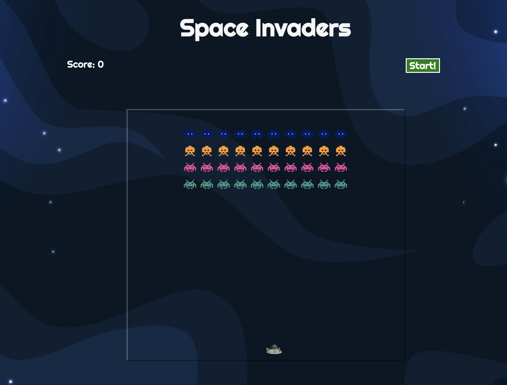
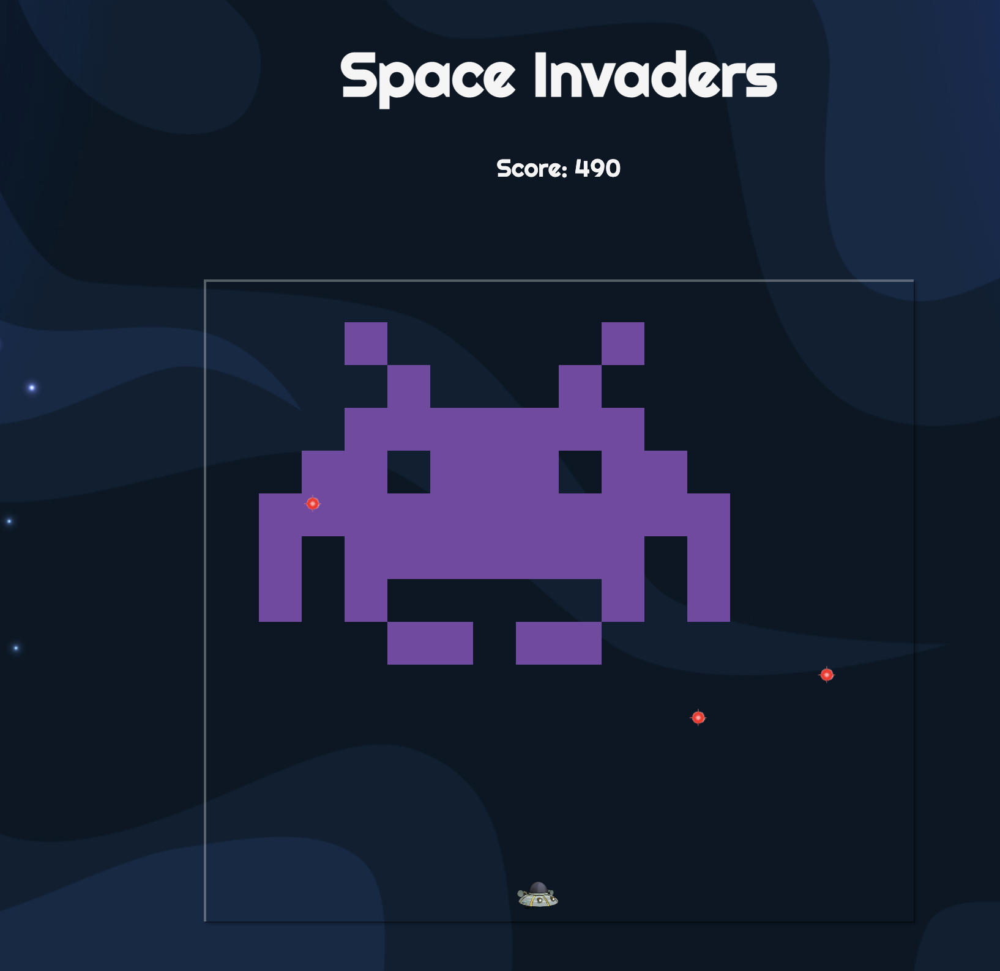

# GA Project-1 Space Invaders

## Overview 
First front-end development project for the Software Engineering Immersive course using pure vanilla Javascript, HTML and CSS


## Technologies used:
* HTML5
* CSS3
* JavaScript


## Brief:
Space Invaders is a classic arcade game from the 80s. The player aims to shoot an invading alien armada, before it reaches the planet's surface using a mounted gun turret.

The player can only move left or right. The aliens also move from left to right, and also down each time the reach the side of the screen. The aliens also periodically drop bombs towards the player.

Once the player has destroyed a wave of aliens, the game starts again. The aim is to achieve the highest score possible before either being destroyed by the aliens, or allowing them to reach the planet's surface.

* The player should be able to clear at least one wave of aliens
* The player's score should be displayed at the end of the game

  


## Approach:
* First, I created a grid by starting with an empty array of 'cells'. After setting a width and height for the grid I used a for- loop to create a div element inside each cell and then appending each cell into the array of 'cells'
* 
* A separate array was created for all aliens and again using for loops aliens were added to each designated cell using the specific index in the array
* Moving aliens- this was done by a set Interval so that the index of the aliens in the array would increase/ decrease by one, and when the invaders hit either wall the direction would change
```
const move = () => {
  const leftWall = allAliens[0] % width === 0
  const rightWall = allAliens[allAliens.length - 1] % width === 15
  const floor = allAliens[allAliens.length - 1] / height > 14.9

  removeAllAliens()
  if (rightWall && goingRight) {
    for (let i = 0; i < allAliens.length; i++) {
      allAliens[i] += width + 1
      direction = -1
      goingRight = false
    }
  }
  if (leftWall && !goingRight) {
    for (let i = 0; i < allAliens.length; i++) {
      allAliens[i] += width - 1
      direction = 1
      goingRight = true
    }
  }
  if (floor && end === false) {
    gameOver()
  }
  for (let i = 0; i < allAliens.length; i++) {
    allAliens[i] += direction
  }
  addAllAliens()
}
```

* The spacehip was added to one of the cells and moving the spaceship was done in a similar way to the aliens, but would be triggered by the arrow key and not by a set interval

* Shooting lasers- if the key 'W' was pressed the ship fires lasers. This was done by adding a laser image to the cell above the position of the spaceship (index - width) and another interval was set here so that the laser would move upwards 
If the index of the laser and an alien equaled the same, the alien would be 'killed' - by removing the image from the aliens array and pushing one to an empty 'dead aliens' array- this allowed me to count how many aliens were removed to know when the player had won the game

* When the invaders hit the bottom of the grid then the game is over 

* Dropping bombs- a random index was generated within the array of aliens to which a bomb image was added. Another interval was set here so that the bomb would drop vertically

* If the player managed to remove all aliens on the grid before they hit the bottom then they would move on to level 2

* Level 2 was created in a very similar way for creating the grid, adding aliens and spaceship and shooting lasers. For this level instead of adding individual small aliens I made it so that it would be a large image of the original space invader alien. 




* Start button starts the intervals of the bombs and aliens and also the event listener to shoot laser:

```
function startGame() {
  setInterval(move, 800)
  document.addEventListener('keydown', killAliens)
  setInterval(dropBomb, 2500)
}
```

## Challenges/ known bugs:
- Clearing the grid of existing lasers and bombs when moving onto level 2
- Getting bombs to be removed as it shows errors in console once they are at bottom of grid
- Getting aliens to change direction when they hit the side walls (atm is when the original most lateral alien hits even when they are removed)
- Sometimes there is a lag when the alien is hit so that the score adds up more slowly and even when all the aliens are removed from the grid it doesn't immediately come up with the next screen 


## Future improvements:
- Having a 'start again' button when the player dies
- Add lives so that the player has more than one chance to complete the game
- Adding local storage to store the players' high score 

## Lessons learned:
* Consolidating basic javascript and CSS knowledge
* Implementing several set intervals and working with arrays 